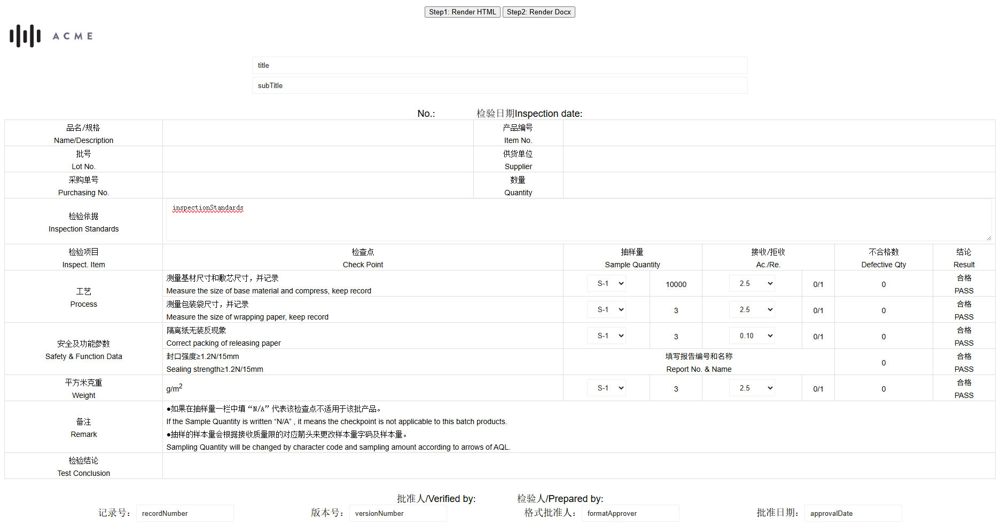
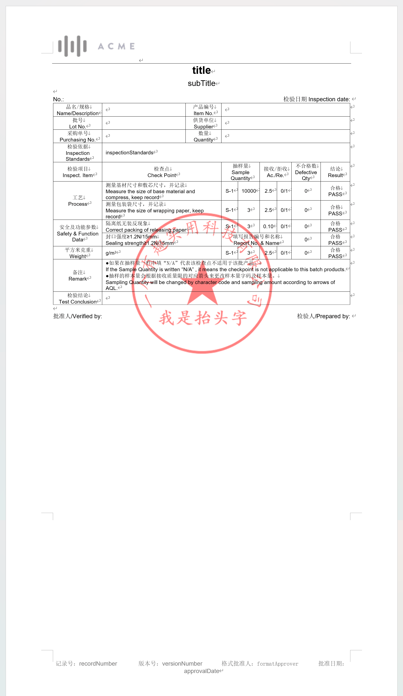

# struct-to-docx

## 简介

基于 [docx](https://github.com/dolanmiu/docx) 库的结构描述生成 `.docx` 文件引擎。支持浏览器和 node.js 环境下使用。

## API

实例方法：

- `setProperties(properties: IDocumentProperties)`：设置[文档属性](https://docx.js.org/#/usage/document?id=document-properties)

- `setDefaultFont(font: string)`：设置默认字体（默认为 Arial）

- `setDefaultFontSize(fontSize: IFontSize)`：设置默认字体大小（默认为 10 磅）。支持字符串（如"初号"）或数值（单位为磅）。
- `addSection(section: ISection)`：添加页面
- `addSections(sections: ISection[])`：添加[多个页面](https://docx.js.org/#/usage/sections?id=sections)
- `render(data?: IData)`：渲染文档模板
- `renderHtml(data?: IData)`：渲染HTML模板
- `fileSave(doc: Document, filename: string)`：保存文档

静态方法：

- `fetchUrlFile(urlStr: string)`：从 URL 获取文件的 ArrayBuffer
- `isChinese(str: string)` ：判断字符串是否包含中文字符或中文标点符号
- `textSize(fontSize: IFontSize)`：字体大小
- `paragraphBorderSize(points: number)`：边框大小
- `paragraphSpacingLine(line: number)`：行高
- `imageTransformationSize(cm: number)`：图像大小
- `imageFloatingPositionOffset(cm: number)`：浮动位置偏移
- `tableCellMarginSize(cm: number)`：默认单元格边距
- `tableCellWidthSize(cm: number)`：单元格宽度
- `tableRowHeightValue(cm: number)`：表格行高
- `cmToTwips(cm: number)`：厘米转换为 twips
- `cmToEmus(cm: number)`：厘米转换为 Emus
- `cmToPx(cm: number)`：厘米转换为像素 (基于 96 DPI)
- `twipsToPx(twips: number)`：twips 转换为像素

## 技巧

大概的包含关系：

- 段落子集：文本、图片
  - 文本
    - 通过 `htmlConfig` 配置，定义渲染的 HTML 元素（默认为 `span`）
    - 通过 `field` 或者 `htmlConfig` 下的 `field` 配置，埋点字段
    - 对于 docx 文档，值使用 `\n` 符号来换行，还支持 `strong`、`b`、`em`、`i`、`u`、`del`、`s`、`sub`、`sup` 标签（等同于 `blod`、`italics`、`underline`、`strike`、`subScript`、`superScript` 配置）
- 表格行子集：表格单元格
- 表格单元格子集：段落

## 示例

简单示例：

```vue
<script setup lang="ts">
import { DocxBuilder } from "struct-to-docx"

function generateDocx() {
  const builder = new DocxBuilder()
  const doc = builder.addSection({
    children: [
      // 段落
      {
        type: "paragraph",
        options: {
          alignment: "center",
          // 子集
          children: [
            // 文本
            {
              type: "text",
              options: {
                text: " This is bold and red text.",
                bold: true,
                color: "FF0000",
                font: "Arial",
                size: DocxBuilder.textSize(12)
              }
            }
          ]
        }
      }
    ]
  }).render()
  builder.fileSave(doc, "example.docx")
}
</script>

<template>
  <div>
    <button @click="generateDocx">
      Generate DOCX
    </button>
  </div>
</template>

<style lang="scss" scoped></style>
```

详细示例：

> 参考 test 目录下的 [test.html](https://github.com/cshaptx4869/struct-to-docx/blob/main/test/test.html) 或 [test.js](https://github.com/cshaptx4869/struct-to-docx/blob/main/test/test.js)




